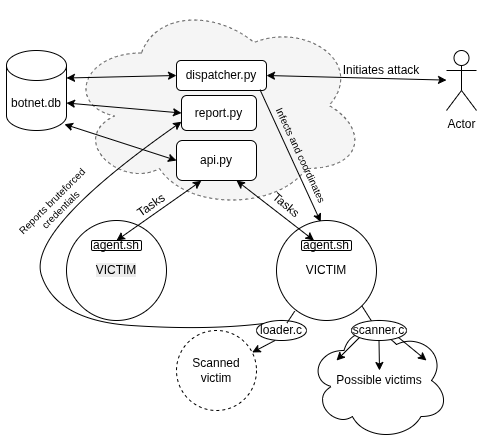

# IoT botnet case study

This codebase is an interactive case-study on the creation, management and utilization of Iot botnets for DDoS attacks.

The acquisition process of devices starts with a simple scan in a subnet for hosts which have the port 23 open (telnet).

Upon noticing such devices, the scanner reports them to a report server which registers them as devices to bruteforce.

The dispatcher will periodically grab devices from this table and tell the device who scanned them to bruteforce them using the `loader.c` 
program. This is an efficient telnet bruteforcer which is capable of multithreading and utilizes the provided username and password wordlists 
to figure out the username:password combo to the device.

Upon successfully bruteforcing the login credentials, the loader will report to the report server the device ip, username and password.
The report server computes a unique id for this device based on the 3 infos mentioned above and stores it in a table.

The dispatcher will periodically select devices that have been bruteforced for infection. Infection with an agent is done via a telnet client in
python which logs into the device, gets the `agent.sh` file from the CnC (Command and Control) API and runs it in the device.

The agent will pull all the necessary payloads from the CnC, give them execute permissions, and periodically query the CnC for instructions.
Upon executing these instructions, which may be to scan for devices, bruteforce devices or launch a ddos attack, it will report their status as complete.

Scheduling of instructions is done automatically by the dispatcher, which will do this with the objective to grow the infected botnet as large as possible.

When the botnet has reached a large enough size, running the attack via `python dispatcher <target_ip>` will have ALL the bots curl a get request.

## Architecture



## How to run

First make sure you have all the python dependencies, and your docker bridge docker0 (default) is 172.18.0.0.

Spins up 10 infection victim containers.

```
cd ./emulation/develnet/
./buildandrun.sh 10
```

Spins up the final DDoS victim container.

```
cd ./emulation/devhttp/
./buildandrun.sh
```

Start report server.

```
cd ./cnc/
python report.py
```

In another window, start the CnC api.

```
cd ./cnc/
uvicorn api:app --host 172.18.0.1 --port 8000
```

Finally, start the dispatcher. This will start the infection process.

```
cd ./cnc/
python3 dispatcher.py
```

You can monitor the infection process by viewing the output of the report.py, api server, or dispatcher.
It is also nice to view the progress in the database:

```
sqlite3 ./db/botnet.db
select * from devices;
select * from devices_tobrute;
select * from instructions;
```

Once you are satisfied with the number of captured devices, hit ctrl-c on the dispatcher.py process and run it again with the arguments:

```
python dispatcher.py <target_ip>
```

Where `target_ip` should be the ip of the http container which you can find out by inspecting the docker network in which it is.

To view the DDoS requests, you can use this command:

```
docker logs dev_http -f
```

## Current implementation status (PLEASE READ ME IF YOU'RE ONE OF THE DEVS)

- [x] Loader -> bruteforces telnet connection to a given ip
    - [x] Loader reports ip:username:pass to report.py collection server

- [x] dispatch.py connects with retrieved telnet credentials to provided ip and "infects" with bot
    - [x] automatically selects uninfected ips to infect
    - [x] has meaningful management capabilities (start infection from 0, orchestrating scanner->loader->infection)
    - [x] interacts with the API endpoints somehow in order to manage the devices (the agent in the infected devices will constantly
    pull for instructions and update the status, but the dispatcher should serve as a higher level wrapper over the api.py to issue orders)

- [x] agent.sh (bot) when deployed to a device pulls necessary payloads from server
    - [x] agent.sh stores the device id locally in the device and is aware of it, and uses it in requests to the server
    - [x] agent.sh marks the device as infected locally (in-device)
    - [x] agent.sh does the management loop (periodically checking for instructions, marking busy, etc.)
    - [x] agent.sh signals the device as infected to the server (the server should do this upon receiving a get request from an agent with the id)

- [x] Scanner -> scans for ips in subnet and tests if they have port 23 open (telnet default)
    - [x] Reports them to report.py collection server in a similar manner to loader 
    - [x] dispatcher.py calls loader on non-bruted scanned devices
